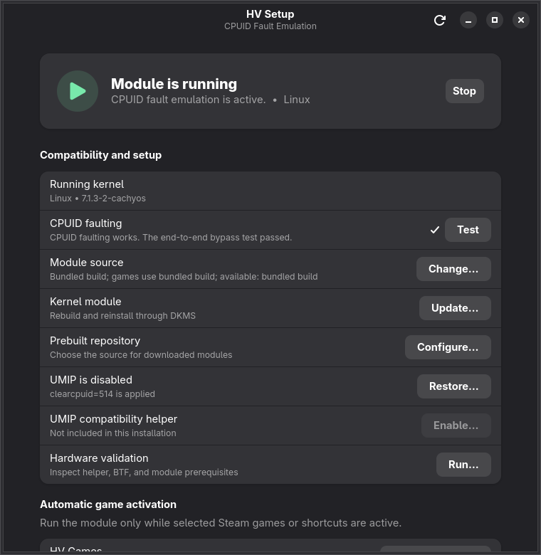

# HV Installer GTK

GTK 4 application for installing and managing CPUID Fault Emulation on x86-64 Linux.



## Features

- Bundled DKMS builds on Arch, Debian/Ubuntu, Fedora, and openSUSE
- Kernel-matched Podman builds on Bazzite and SteamOS
- Exact-kernel prebuilt module downloads from validated GitHub release repositories
- Safe folder or ZIP source import with isolated manual artifacts
- Explicit module source selection for interactive and automatic activation
- Steam library and non-Steam shortcut discovery
- Steam-log monitoring with `/proc` reconciliation for missed events
- Reversible UMIP boot options and an optional GPL-2.0 eBPF compatibility helper
- CPUID diagnostics and bounded persistent operation logs

## Install

### AppImage (recommended on x86-64)

1. Download `HV-Installer-GTK-*-x86_64.AppImage` and its matching `.sha256` from the [latest release](https://github.com/xXJSONDeruloXx/hv-installer-gtk/releases/latest).
2. In the download directory, run `sha256sum -c HV-Installer-GTK-*-x86_64.AppImage.sha256`.
3. Mark it executable and launch it: `chmod +x HV-Installer-GTK-*-x86_64.AppImage && ./HV-Installer-GTK-*-x86_64.AppImage`.

The AppImage bundles Python, GTK 4, libadwaita, the module source, and the opt-in
helper source/binary. The first privileged action installs a verified, root-owned native
backend under `/usr/local`; the AppImage itself never becomes the privileged backend.
It requires an x86-64 host with a current glibc-based desktop, `pkexec`, and the existing
host build tooling (DKMS or Podman) required for your selected module path.

### ZIP

1. Download the ZIP and matching `.sha256` from the [latest release](https://github.com/xXJSONDeruloXx/hv-installer-gtk/releases/latest).
2. Verify it, for example with `sha256sum -c hv-installer-gtk-*.zip.sha256` in the download directory.
3. Extract the ZIP.
4. Right-click **HV Installer GTK** and choose **Run as program**.

Both formats request administrator access once at launch and use a verified,
root-owned backend for privileged operations. Manual Makefiles and custom release
repositories are user-trusted inputs; review them before use.

## Module sources

- **Bundled build** is the default and preserves the existing DKMS/container path.
- **Downloaded prebuilt** requires an asset named
  `cpuid_fault_emulation-<running-kernel>.ko`. `modinfo` must report the exact running
  kernel. A matching `.ko.sha256` release asset is verified whenever one is published.
- **Manual source** copies a selected folder or safely extracts a ZIP into root-owned
  state. Its module is built and promoted separately from the bundled installation.

Interactive activation and automatic game activation can select different managed
artifacts from the **Module source** dialog.

## UMIP compatibility helper

Releases include `umipcompatd`, built from the pinned
[`xXJSONDeruloXx/umipcompatd`](https://github.com/xXJSONDeruloXx/umipcompatd) fork.
The helper is disabled by default. When explicitly enabled, it starts before the module
and stops with it; failed module startup rolls back a helper started by that operation.
The release ZIP includes the helper's GPL-2.0 license, source archive, and exact source
revision.

The helper supplements, rather than silently changes, the reversible `clearcpuid=514`
boot option. See [`docs/HARDWARE_VALIDATION.md`](docs/HARDWARE_VALIDATION.md) before
enabling it on new hardware or kernels.

## Supported systems

- Bazzite and SteamOS using a kernel-matched Podman build
- Arch Linux, Debian, Ubuntu, Fedora, and openSUSE using DKMS
- GRUB, Limine, systemd-boot, and Bazzite rpm-ostree kernel arguments

Bazzite and SteamOS builds require Git, Podman, and `runuser`. Container storage uses
approximately 1 to 2 GB.

## Development

```bash
make check
./hv-installer-gui.py
```

Build the complete release, including the pinned helper binary and corresponding source:

```bash
make release
(cd dist && sha256sum -c hv-installer-gtk-*.zip.sha256)
(cd dist && sha256sum -c HV-Installer-GTK-*-x86_64.AppImage.sha256)
```

The helper build requires Git, Cargo/Rust, Clang, and the native build dependencies used
by vendored `libbpf`. `make appimage` additionally requires Docker and builds the x86-64
AppImage in the pinned Ubuntu container with checksummed linuxdeploy, appimagetool, and
AppImage runtime inputs. CI builds and verifies both release formats.

## License

HV Installer GTK is GPL-2.0. The separately attributed helper source and license are
included with every release.

## Disclaimer

This software is made solely for exploration and research purposes. You are responsible
for reviewing privileged code and validating it on your hardware before use.
